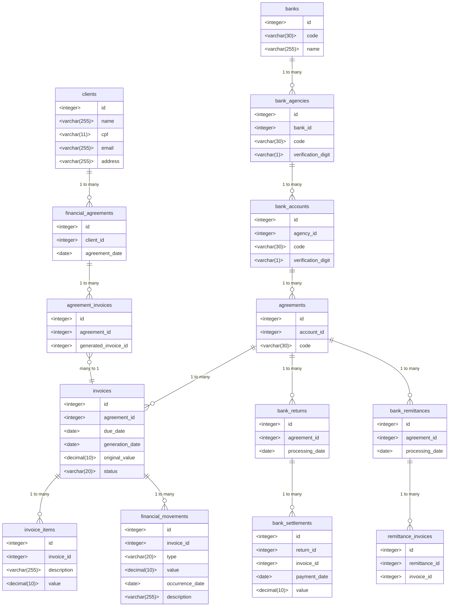

```mermaid
erDiagram
    clients {
        ~integer~ id
        ~varchar(255)~ name
        ~varchar(11)~ cpf
        ~varchar(255)~ email
        ~varchar(255)~ address
    }
    banks {
        ~integer~ id
        ~varchar(30)~ code
        ~varchar(255)~ name
    }
    bank_agencies {
        ~integer~ id
        ~integer~ bank_id
        ~varchar(30)~ code
        ~varchar(1)~ verification_digit
    }
    bank_accounts {
        ~integer~ id
        ~integer~ agency_id
        ~varchar(30)~ code
        ~varchar(1)~ verification_digit
    }
    agreements {
        ~integer~ id
        ~integer~ account_id
        ~varchar(30)~ code
    }
    invoices {
        ~integer~ id
        ~integer~ agreement_id
        ~date~ due_date
        ~date~ generation_date
        ~decimal(10)~ original_value
        ~varchar(20)~ status
    }
    invoice_items {
        ~integer~ id
        ~integer~ invoice_id
        ~varchar(255)~ description
        ~decimal(10)~ value
    }
    financial_movements {
        ~integer~ id
        ~integer~ invoice_id
        ~varchar(20)~ type
        ~decimal(10)~ value
        ~date~ occurrence_date
        ~varchar(255)~ description
    }
    financial_agreements {
        ~integer~ id
        ~integer~ client_id
        ~date~ agreement_date
    }
    agreement_invoices {
        ~integer~ id
        ~integer~ agreement_id
        ~integer~ generated_invoice_id
    }
    bank_returns {
        ~integer~ id
        ~integer~ agreement_id
        ~date~ processing_date
    }
    bank_settlements {
        ~integer~ id
        ~integer~ return_id
        ~integer~ invoice_id
        ~date~ payment_date
        ~decimal(10)~ value
    }
    bank_remittances {
        ~integer~ id
        ~integer~ agreement_id
        ~date~ processing_date
    }
    remittance_invoices {
        ~integer~ id
        ~integer~ remittance_id
        ~integer~ invoice_id
    }

    clients ||--o{ financial_agreements : "1 to many"
    financial_agreements ||--o{ agreement_invoices : "1 to many"
    agreement_invoices }o--|| invoices : "many to 1"
    invoices ||--o{ invoice_items : "1 to many"
    invoices ||--o{ financial_movements : "1 to many"
    banks ||--o{ bank_agencies : "1 to many"
    bank_agencies ||--o{ bank_accounts : "1 to many"
    bank_accounts ||--o{ agreements : "1 to many"
    agreements ||--o{ invoices : "1 to many"
    bank_returns ||--o{ bank_settlements : "1 to many"
    bank_remittances ||--o{ remittance_invoices : "1 to many"
    agreements ||--o{ bank_returns : "1 to many"
    agreements ||--o{ bank_remittances : "1 to many"
```